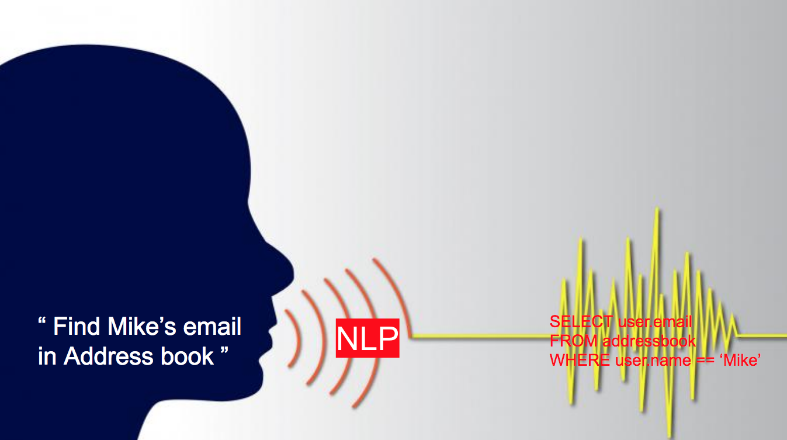

# 2019년 한이음 프로젝트
## NL2SQL팀
본 레포지토리는 **2019년 한이음 프로젝트**인 '자연어를 SQL로'를 위한 레포지토리입니다.

----

## 팀 구성
### 멘토
안현순 : 오스템 임플란트
### 멘티
성민석 : 홍익대학교 컴퓨터공학과 4학년 
이근주 : 홍익대학교 컴퓨터공학과 4학년  
한인수 : 홍익대학교 컴퓨터공학과 4학년  

---

## 프로젝트 개요
### 프로젝트 소개
- 처음 데이터베이스를 공부할 때, 비슷한 문장도 조사 하나에 의해 전혀 다른 쿼리가 되는 것에서 경험함
- 간단한 문장은 SQL 쿼리문으로 쉽게 변환할 수 있으나, 문장이 점차 복잡하고 세밀해질수록 SQL 쿼리문을 구성하기 매우 힘든 점이 있음
- SQL을 결정하는 조사, 관계문 등이 정해져있고, 약간의 반복되는 규칙성을 존재함을 발견하여 사람의 자연어를 분석하여 SQL 쿼리문으로 변환하는 알고리즘을 구상함
- 결론적으로 자연어를 SQL로 바꿔주는 프로그램을 개발하여 데이터베이스를 배우는 입문자들이 쉽게 SQL을 배우는 것이 목적으로 함

|예상일정|예상팀원(수)|예상난이도|
|:---:|:---:|:---:|
|2019.04.01 ~ 2019.11.30|3~4명|상 / **중** / 하|

---

## 주요기능 및 예상결과물
### SQL 분석
자주 사용되는 SQL 패턴 분석
### 자연어 처리
자연어처리를 통해서 자연어를 분석하고, SQL로 구성요소로 변환하는 프로그램
### 웹/앱
클라우드 서비스를 통해 서버구축 후 다양한 DBMS와 연동이 가능한 웹 페이지를 구성
### 결과 확인
입력한 자연어 명령을 인공지능 학습을 통해서 반환된 SQL을 DBMS에 적용

---

## 핵심기술
### 언어
Python, C/C++, C#
### 프론트엔드 
HTML/CSS, Javascript ( React / Angular / Vue / Node.js )
### 백엔드
MariaDB / MySQL
### 인공지능 
Deep Learning Framework ( Tensorflow, Keras )
### 기타
Cognative Service  
Cloud Server : Microsoft Azure  
Automata  

---

## 예상 이미지

--- 

### 예시 구문
#### 자연어
Hey! Find Mike's Email in Address Book
#### SQL
`SELECT` **email**  
`FROM` **addressbook**  
`WHERE` name == '**Mike**';

---

## 기대효과 및 활용분야
### 기대효과 
초보자들의 데이터베이스 학습 도움 
### 활용분야
데이터베이스를 처음 배우는 학습기관 
기존의 DBMS와 연동할 수 있는 서버 구축 
데이터셋 자동 구성을 통해서 SQL 사용하는 현업에서도 사용

---

## 참고사항
- 

---

Copyright (c) 2019, Team NL2SQL